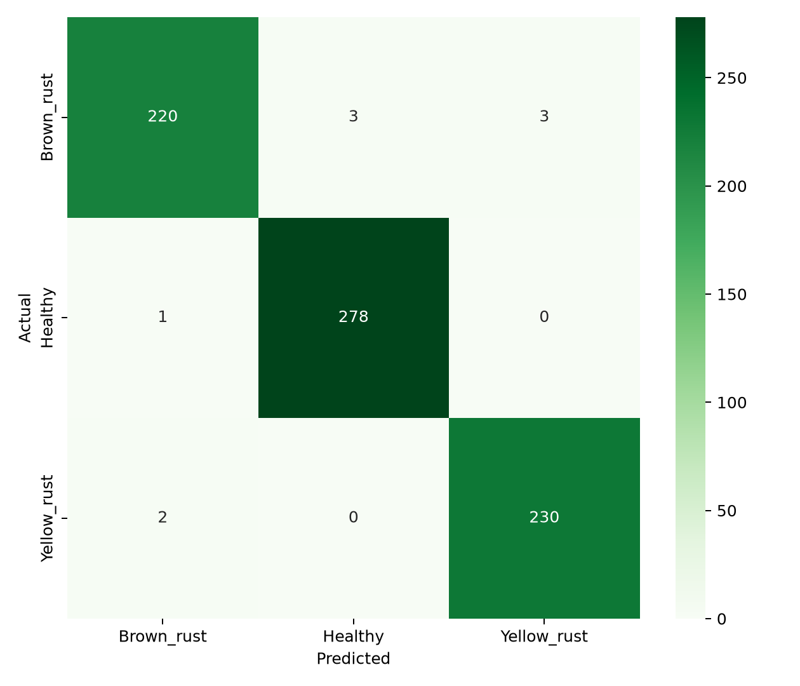

# Wheat Rust AI Detection

An applied computer-vision project for classifying wheat-leaf images as **Healthy**, **Brown Rust**, or **Yellow Rust**, with a complementary anomaly-detection experiment trained only on healthy leaves.

## Live demonstration

[Launch the Wheat Rust AI Detection app](https://devanandha-wheat-rust-ai.streamlit.app/)

This repository is a reproducible extension of my 2024 MSc Artificial Intelligence dissertation at Ulster University. The original research explored Isolation Forest, autoencoders, transfer learning, image preprocessing, and YOLO-based object-detection concepts. The 2026 extension reorganises the experimental scripts into a transparent training and evaluation pipeline and adds an interactive demonstration.

> This is a research prototype, not an agronomic or diagnostic tool. Predictions should not be used as the sole basis for crop-treatment decisions.

## Project highlights

- Three-class MobileNetV2 transfer-learning pipeline
- Reproducible image loading and augmentation
- Separate training and validation sets
- Precision, recall, F1-score, confusion matrix, and classification report
- Healthy-only convolutional autoencoder for anomaly detection
- Streamlit image-upload demonstration with class probabilities
- Dataset audit script for counts, corrupt files, and exact duplicates
- Clear separation between the original dissertation and subsequent engineering work

## Verified results

The rebuilt MobileNetV2 classifier was trained for 10 epochs and evaluated on the supplied validation split of 737 images.

| Class | Precision | Recall | F1-score | Images |
|---|---:|---:|---:|---:|
| Brown Rust | 98.65% | 97.35% | 98.00% | 226 |
| Healthy | 98.93% | 99.64% | 99.29% | 279 |
| Yellow Rust | 98.71% | 99.14% | 98.92% | 232 |
| **Overall / weighted** | **98.78%** | **98.78%** | **98.78%** | **737** |

The classifier correctly predicted 728 of 737 validation images. These figures describe performance on this dataset's validation split; they are not a claim of real-world diagnostic accuracy.



The healthy-only autoencoder experiment did not separate disease images successfully: disease recall and F1-score were 0, with ROC-AUC 0.086. This negative result is retained because it supports the model-selection decision rather than being hidden. See [RESULTS.md](docs/RESULTS.md).

## Dataset

The project uses the **Wheat Disease Detection / Wheat Rust Classification Dataset** published on Kaggle by `sinadunk23`:

https://www.kaggle.com/datasets/sinadunk23/behzad-safari-jalal

The complete dataset contains 3,679 images:

| Class | Train | Validation | Total |
|---|---:|---:|---:|
| Brown Rust | 902 | 226 | 1,128 |
| Healthy | 1,116 | 279 | 1,395 |
| Yellow Rust | 924 | 232 | 1,156 |
| **Total** | **2,942** | **737** | **3,679** |

The dataset is not redistributed in this repository. Download it from the source and confirm its current licence and terms before use.

Expected structure:

```text
data/
├── train/
│   ├── Brown_rust/
│   ├── Healthy/
│   └── Yellow_rust/
└── val/
    ├── Brown_rust/
    ├── Healthy/
    └── Yellow_rust/
```

## Quick start

```bash
python -m venv .venv
# Windows: .venv\Scripts\activate
# macOS/Linux: source .venv/bin/activate
pip install -r requirements.txt
python -m src.audit_dataset --data-dir data
python -m src.train_classifier --data-dir data --epochs 10
python -m src.evaluate --data-dir data --model models/wheat_rust_mobilenetv2.keras
streamlit run app.py
```

Train the anomaly detector separately:

```bash
python -m src.train_anomaly --data-dir data --epochs 15
```

## Methodology

### Classification

MobileNetV2, pretrained on ImageNet, is used as a frozen feature extractor. A global-average-pooling layer, dropout, and three-class softmax head are trained on the wheat dataset. Augmentation is applied only during training.

### Anomaly detection

The convolutional autoencoder is trained **only on healthy training images**. A reconstruction-error threshold is calibrated from held-out healthy validation images. Brown Rust and Yellow Rust images are then treated as anomalous examples. This design avoids teaching the autoencoder to reconstruct diseases as normal.

## Evaluation integrity

- Training and validation folders are separate.
- The uploaded dataset was checked for exact duplicates: none were found within or across the supplied splits.
- Reported results come from saved output files generated by this repository.
- The new pipeline achieved 98.78% validation accuracy. The 96.88% result in the 2024 dissertation remains a separate historical result.
- Object localisation is not claimed as a trained capability because the available dataset contains class folders rather than verified bounding-box labels.

## Repository layout

```text
app.py
src/
├── audit_dataset.py
├── data.py
├── evaluate.py
├── model.py
├── train_anomaly.py
└── train_classifier.py
docs/
├── EVIDENCE_NOTES.md
└── ORIGINAL_VS_EXTENSION.md
models/                 # generated locally; model files ignored by Git
outputs/                # verified reports and plots included as evidence
```

## Research limitations

- Dataset provenance and field conditions may limit generalisation.
- Images have varied dimensions, lighting, backgrounds, and crop framing.
- A random image-level split may overestimate generalisation if visually related crops originate from the same source photograph.
- The classifier recognises dataset-level visual patterns; it does not establish biological causation.
- Reliable deployment would require external field data, expert review, calibration, and prospective testing.
- Exact-file duplicate checks cannot detect near-duplicates, crops derived from the same source image, or source-level leakage.

## Technical Article

- [Read the Wheat Rust AI technical article](docs/WHEAT_RUST_AI_TECHNICAL_ARTICLE.pdf)
- [Try the live Streamlit demonstration](https://devanandha-wheat-rust-ai.streamlit.app/)
- [Read the published LinkedIn technical article](https://www.linkedin.com/pulse/when-anomaly-detection-failed-lessons-from-building-wheat-vs-iotze/)
  
## Responsible use

This software is intended for education and research. Consult a qualified crop specialist before acting on a prediction. Do not use the system to recommend pesticide products or treatment quantities.

## Author

Devanandha V. S. — MSc Artificial Intelligence, Ulster University  
LinkedIn: https://www.linkedin.com/in/devanandhavs21
